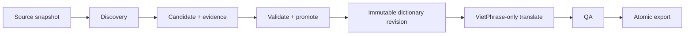
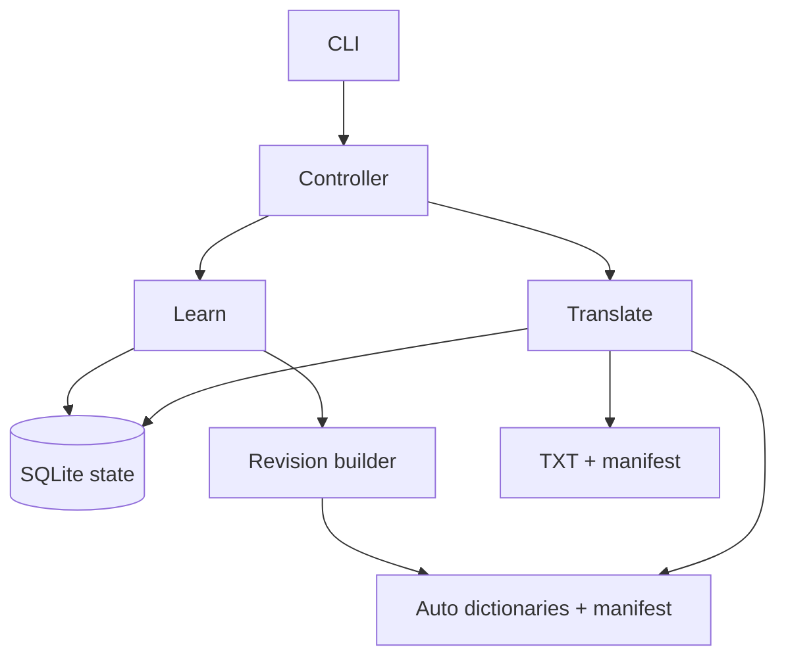

# Architecture Spine — zhvi VietPhrase-only

## Design Paradigm

**Pipes-and-filters hai pha:** LEARN được quyền đề xuất và tạo dictionary revision; TRANSLATE chỉ đọc source snapshot cùng một revision đã freeze. SQLite giữ workflow/provenance; file từ điển đã materialize là artifact cho engine.



## Invariants & Rules

### AD-1 — Một engine dịch duy nhất

- **Binds:** toàn bộ translation-pipeline.
- **Prevents:** output khác nhau do router hoặc engine hậu biên tập.
- **Rule:** VietPhrase là đường duy nhất sinh target text; không có model inference, network model call, local patch hay post-edit stage.

### AD-2 — Mọi correction đi qua dictionary

- **Binds:** review, feedback, rerun và export.
- **Prevents:** tồn tại hai nguồn chân lý giữa text đã sửa và dictionary.
- **Rule:** người hoặc máy chỉ sửa entry/rule; affected blocks phải được dịch lại. Không lưu block text đã sửa như canonical output.

### AD-3 — Dictionary revision bất biến trong một run

- **Binds:** run, cache, resume và concurrent promotion.
- **Prevents:** các block trong cùng run dùng entry khác phiên bản hoặc resume từ file mutable đã đổi.
- **Rule:** run pin một content-addressed revision bundle; `dictionary_revision_id` là SHA-256 của canonical manifest gồm hash mọi base/global/book/manual/auto layer cùng loader, renderer và precedence version. Run không đọc file nguồn/projection sau khi pin.

### AD-4 — Tách quyền ghi LEARN và TRANSLATE

- **Binds:** pipeline orchestration.
- **Prevents:** học hoặc promote giữa vòng lặp dịch.
- **Rule:** LEARN kết thúc bằng revision `ready`; TRANSLATE chỉ đọc revision `ready` đã freeze và không mutate candidate/entry state.

### AD-5 — Manual thắng auto khi cùng key/span

- **Binds:** dictionary loader, revision builder và conflict handling.
- **Prevents:** máy ghi đè quyết định của người dùng hoặc precedence mâu thuẫn longest-match.
- **Rule:** với candidate cùng normalized source key/span, precedence là `manual book > manual global > Custom/QualityOverrides > auto book > auto global > base`. Span dài vẫn thắng span ngắn; override segmentation cần manual entry cho key dài. Learner không được ghi file human-owned.

### AD-6 — Target tự học phải xác định

- **Binds:** candidate builder và promotion gate.
- **Prevents:** learner bịa nghĩa để tăng coverage.
- **Rule:** target chỉ được lấy từ entry/rule/phiên âm đã biết, correction của người dùng hoặc entry đã accept có provenance; không dựng được target đơn nghĩa thì candidate là `unresolved`.

### AD-7 — Promotion theo tầng và hard gate

- **Binds:** candidate lifecycle.
- **Prevents:** một điểm tổng hợp cao che giấu conflict hoặc regression.
- **Rule:** lifecycle là `observed → candidate → book_auto → global_candidate → global_auto`; mỗi bước phải pass hard gates. Global-auto bắt buộc có cross-book evidence và golden regression.

### AD-8 — SQLite sở hữu state; file là artifact

- **Binds:** candidate, evidence, promotion, revision và rollback.
- **Prevents:** state DB và file auto dictionary cùng được coi là nguồn chân lý.
- **Rule:** base/manual files do người sở hữu; book SQLite sở hữu book learning; dictionary-root registry SQLite sở hữu global learning. Immutable revision bundle là input của run; `AutoVietPhrase.txt`, `glossary.auto.tsv` và trie cache chỉ là projection có thể dựng lại.

### AD-9 — Translation path xác định

- **Binds:** VietPhrase core và trace.
- **Prevents:** output phụ thuộc iteration order hoặc top-K ambiguity.
- **Rule:** render chọn span dài nhất trước; với cùng span chọn layer precedence, literal-over-pattern rồi tie-break ổn định theo `entry_id`. Lattice/top-K nếu tồn tại chỉ phục vụ LEARN.

### AD-10 — QA không mutate output

- **Binds:** QA và export.
- **Prevents:** hidden repair làm mất reproducibility.
- **Rule:** QA chỉ pass hoặc chặn; failure chuyển run sang `needs_dictionary_fix`, sau đó entry/rule được sửa và affected blocks được rerun.

### AD-11 — Cache và output truy được về input

- **Binds:** fingerprint, checkpoint, resume và export.
- **Prevents:** tái dùng kết quả từ dictionary/config khác.
- **Rule:** cache key chứa source block hash, dictionary revision, parser, renderer và QA version; output manifest chứa run ID, revision ID và SHA-256.

### AD-12 — Rollback là revision mới

- **Binds:** recovery và audit.
- **Prevents:** lịch sử revision bị sửa hoặc mất provenance.
- **Rule:** revoke/rollback append event và build revision kế tiếp từ tập entry an toàn; revision lịch sử chỉ đọc.

### AD-13 — Một writer cho mỗi mutation scope

- **Binds:** project learning, global promotion và revision activation.
- **Prevents:** hai builder tạo hoặc activate các revision xung đột.
- **Rule:** một project writer lock cho book state. `realpath(dict_dir)` xác định duy nhất registry tại `<dict_dir>/.zhvi-registry/`; chỉ registry writer lock được mutate global state/projection. Activation dùng CAS trên active revision kỳ vọng; stale writer phải evaluate/build lại.

### AD-14 — Global promotion fail-closed

- **Binds:** global learner.
- **Prevents:** nâng cấp toàn cục khi chưa có dữ liệu chứng minh không regression.
- **Rule:** thiếu approved golden manifest, cross-book evidence, target agreement hoặc affected-block isolation thì candidate không vượt `global_candidate`; file tên `expect*` không tự trở thành golden.

### AD-15 — Publish revision không cần transaction xuyên DB/filesystem

- **Binds:** revision builder, activation, recovery và garbage collection.
- **Prevents:** DB trỏ tới bundle dở dang hoặc crash làm mất active revision hợp lệ.
- **Rule:** build ở temp → fsync files/directories → atomic rename vào content-addressed path → SQLite transaction insert `ready` và CAS active pointer → dựng projection sau commit. Orphan bundle được GC; projection lệch được reconciler dựng lại; translation không đọc projection.

### AD-16 — Active pointer có cardinality rõ

- **Binds:** global revision, book composite revision và run creation.
- **Prevents:** nhiều revision cùng được xem là active hoặc book âm thầm đổi global base.
- **Rule:** `active_revisions(scope_type, scope_id)` có đúng tối đa một row mỗi scope. Book revision pin một global revision ID cộng hash book auto/manual; global activation không đổi active book revision hiện có. Run mới chỉ pin active book revision; run lịch sử có thể đọc bundle superseded/revoked để reproduce.

### AD-17 — Evidence toàn cục không đếm trùng book/source

- **Binds:** cross-book evidence và global promotion.
- **Prevents:** copy project, import lại hoặc nhiều source revision của cùng truyện giả tạo đủ ngưỡng global.
- **Rule:** `zhvi init` tạo stable `book_id`; registry deduplicate occurrence theo `(book_id, source_revision_id, candidate_id, occurrence_span)` và chỉ tính active source revision mỗi book vào promotion evidence.

### AD-18 — Preprocessing và rendering là transformation có trace

- **Binds:** junk stripping, repetition collapse, fingerprint và QA boundary.
- **Prevents:** QA âm thầm sửa source/output hoặc transformation không tái lập.
- **Rule:** deterministic preprocessor tạo translation view bằng versioned rules và source-offset trace; renderer có thể collapse artifact tại target-span boundary và ghi trace. QA chỉ đọc, không mutate. Cả hai version tham gia revision/run fingerprint.

### AD-19 — Brownfield cutover bảo toàn lịch sử nhưng không tái dùng model artifacts

- **Binds:** schema migration, cache, config, dependencies và run creation.
- **Prevents:** mất audit history hoặc run mới vô tình dùng route/cache/runtime model-era.
- **Rule:** migration chỉ add/transform, không drop lịch sử; route/attempt/model metadata cũ được giữ read-only. Mọi cache chứa prompt/model/router fingerprint bị invalidate. Sau cutover, runtime xóa model workers/dependencies/config/flags và run mới chỉ ghi route `VIETPHRASE`.

### AD-20 — Book-auto và output trace có hard gate tối thiểu

- **Binds:** book candidate promotion, trace, QA và export.
- **Prevents:** auto-promote target mơ hồ hoặc xuất text không giải thích được.
- **Rule:** book-auto bắt buộc deterministic single target, không manual conflict, structural QA pass và affected-block isolation pass; ngưỡng thống kê là config. Export bắt buộc 100% output spans truy tới source literal hoặc versioned VietPhrase entry/rule/transformation.

## Consistency Conventions

| Concern | Convention |
|---|---|
| ID | SHA-256 cho content/revision; UUID cho event/run; ID đã phát hành không tái sử dụng |
| Book identity | Stable `book_id` được tạo khi init; bản copy giữ ID nên không được tính là truyện độc lập |
| Entry format | `source=target`, UTF-8, NFC; source giản thể dùng để index nhưng source gốc giữ trong provenance |
| Ownership | File có hậu tố `.manual.*` là human-owned; `.auto.*` và `AutoVietPhrase.txt` là machine-owned |
| Mutation | Candidate/entry mutation append event trong SQLite; revision publish tuân đúng AD-15 |
| Revision identity | SHA-256 canonical manifest của mọi layer hash + loader/renderer/precedence version |
| Activation | Một active pointer mỗi scope; update bằng compare-and-swap |
| Conflict | Auto conflict cùng scope/layer làm build fail; legacy base/human conflict dùng source/file/load order đã freeze và phát diagnostic |
| Errors | Validation/promotion fail không đổi active revision; translation QA fail không export |
| Config | Mọi field ảnh hưởng learning, segmentation hoặc render phải tham gia fingerprint |
| Observability | Report metric riêng lẻ; không gộp thành một quality score không có ground truth |

## Structural Seed

```text
zhvi/src/zhvi/
  pipeline.py          # phối hợp LEARN rồi TRANSLATE
  preprocessing.py     # versioned source view + offset trace
  learning/            # discovery, candidate, evidence, promotion
  revisions/           # build, validate, diff, activate, rollback
  vietphrase/          # loader, trie, matcher, renderer, trace
  quality/             # structural, golden, metamorphic gates
  state.py             # workflow/provenance transaction boundary
```



```text
<resolved-dict-dir>/.zhvi-registry/
  state.sqlite3          # global candidate/evidence/active pointer
  revisions/<sha256>/    # immutable global bundles
  locks/registry.lock

<book>/.zhvi/revisions/<sha256>/
  manifest.json          # global revision + every book/manual/base layer hash
  entries.tsv
  patterns.jsonl
  dictionary.bin         # engine artifact pinned by runs
```

## Capability → Architecture Map

| Capability / Area | Lives in | Governed by |
|---|---|---|
| Dịch TXT | preprocessing + pipeline + vietphrase | AD-1, AD-3, AD-9, AD-11, AD-18 |
| Sửa chất lượng | terms/revisions | AD-2, AD-5, AD-12 |
| Học theo truyện | learning + `glossary.auto.tsv` | AD-4, AD-6, AD-7, AD-20 |
| Học toàn cục | dictionary-root registry + `AutoVietPhrase.txt` projection | AD-5, AD-7, AD-13, AD-14, AD-15 |
| QA/regression | quality | AD-10, AD-14 |
| Resume/cache/export | state + revision bundle + export | AD-3, AD-8, AD-11, AD-15, AD-16 |
| Brownfield cutover | migration + config + runtime dependencies | AD-19 |

## Fast-path Assumptions

- `[ASSUMPTION]` Ngưỡng frequency, chapter count, cross-book count, PMI/entropy và regression budget trong solution design là default khởi tạo, không phải invariant. `raw_china/expect*.txt` cùng legacy typo `raw_china/excpect*.txt` chỉ là candidate reference; phải tạo approved golden manifest trước khi bật global auto-promotion.
- `[ASSUMPTION]` Book-auto được bật mặc định sau hard gates; nếu benchmark cho thấy false promotion đáng kể, default chuyển thành candidate-only mà không đổi AD-1 đến AD-17.

## Deferred

- Tokenizer/ngắt từ ngoài VietPhrase: chờ n-gram learner được benchmark.
- Entry đa nghĩa theo context: chờ có rule context xác định; không auto-promote target mơ hồ.
- Đồng bộ revision giữa nhiều máy: trước mắt dùng export/import manifest.
- Web UI, API và worker queue: CLI là sản phẩm chính.
