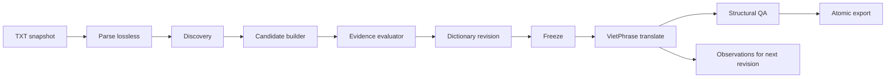
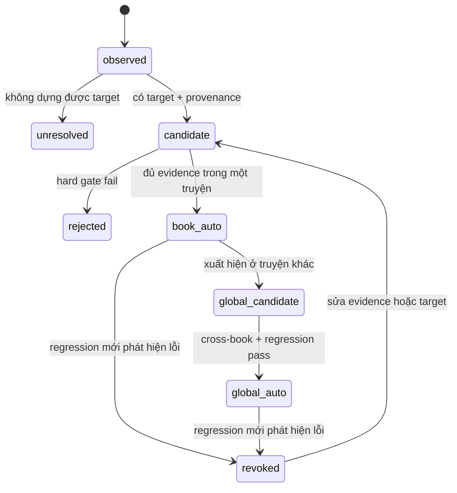
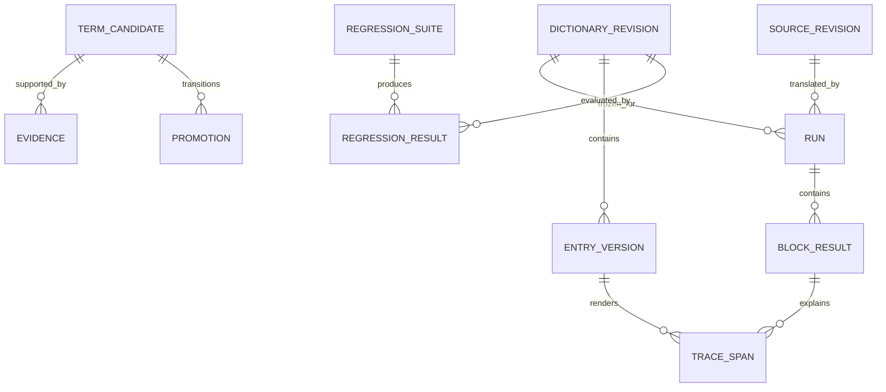

# Thiết kế hệ thống dịch truyện Trung → Việt bằng VietPhrase

## VietPhrase-only, tự nâng cấp từ điển, không AI hậu biên tập

Phiên bản thiết kế: 3.0  
Trạng thái: final  
Phạm vi: CLI `zhvi`, dữ liệu từ điển dùng chung trong `crawler/vietphrase/dicts/`

> `[ASSUMPTION]` Các ngưỡng học tự động trong tài liệu là giá trị khởi tạo an toàn. Các file `raw_china/expect*.txt` và file legacy viết sai tên `raw_china/excpect*.txt` hiện chỉ là candidate reference, chưa phải golden đã duyệt; global auto-promotion phải giữ khóa cho tới khi có golden manifest hợp lệ.

## 1. Quyết định kiến trúc

`zhvi` trở thành một **translation memory compiler dựa hoàn toàn trên VietPhrase**.

Hệ thống chỉ có một đường sinh văn bản:

```text
Chinese source + Dictionary revision + Deterministic rules
                         ↓
                  VietPhrase engine
                         ↓
                    Vietnamese TXT
```

Không có HachimiMT, Qwen, Ollama, prompt, model router, local patch hay AI post-edit. Không có engine thứ hai để “sửa” kết quả VietPhrase.

Mọi cải thiện chất lượng phải đi qua vòng lặp:

```text
phát hiện cụm yếu
→ tạo ứng viên VietPhrase bằng dữ liệu và quy tắc xác định
→ kiểm định trên corpus
→ promote thành dictionary revision mới
→ dịch lại các block bị ảnh hưởng
```

### Invariant bắt buộc

1. VietPhrase là engine dịch duy nhất.
2. Một run chỉ đọc một dictionary revision bất biến.
3. Không sửa trực tiếp văn bản đích sau khi dịch.
4. Mọi thay đổi bản dịch phải truy được về entry/rule và revision đã tạo ra nó.
5. File thủ công không bao giờ bị tiến trình học tự động ghi đè.
6. Cùng source revision, dictionary revision và config phải tạo cùng output.
7. Một promotion thất bại regression phải bị reject, không được “cố dùng rồi cảnh báo”.

## 2. Mục tiêu và phi mục tiêu

### Mục tiêu

- Dịch TXT nhanh, offline và tái lập hoàn toàn.
- Tập trung công sức vào chất lượng VietPhrase thay vì hậu biên tập từng đoạn.
- Tự phát hiện cụm từ, tên riêng và cách phân đoạn làm bản dịch khó đọc.
- Tự tạo và promote entry an toàn ở phạm vi một truyện.
- Tích lũy bằng chứng qua nhiều truyện để nâng cấp VietPhrase toàn cục.
- Rollback được mọi thay đổi tự học.
- Giữ snapshot lossless, checkpoint/resume, cache và atomic export hiện có.

### Phi mục tiêu

- Dịch bằng mô hình ngôn ngữ hoặc mô hình máy dịch.
- Viết lại câu cho “mượt” sau khi VietPhrase đã sinh kết quả.
- Tự đoán nghĩa mới khi từ điển hiện tại không cung cấp đủ dữ liệu.
- Tự ghi vào `Custom.txt`, `QualityOverrides.txt` hoặc `VietPhrase_*.txt`.
- Tối ưu văn phong từng câu bằng thông tin không thể biểu diễn thành entry/rule.
- Chạy như service phân tán; CLI foreground vẫn là sản phẩm chính.

## 3. Paradigm: pipes-and-filters hai pha

Hệ thống chia thành hai pha độc lập:



### Pha LEARN

LEARN được phép đọc corpus, tạo candidate, chạy mô phỏng và tạo dictionary revision mới. Pha này không tạo bản dịch cuối cùng.

### Pha TRANSLATE

TRANSLATE chỉ đọc source snapshot và dictionary revision đã freeze. Pha này không được học, promote hay thay đổi bất kỳ file từ điển nào.

Ranh giới này ngăn cùng một run dịch chương đầu và chương cuối bằng hai phiên bản từ điển khác nhau.

## 4. Quyền sở hữu và thứ tự ưu tiên từ điển

Từ thấp đến cao:

| Lớp | Artifact | Chủ sở hữu | Phạm vi | Máy được ghi? |
|---|---|---|---|---|
| Phiên âm | `ChinesePhienAmWords.txt` | dữ liệu nền | toàn cục | không |
| VietPhrase nền | `VietPhrase_1.txt`…`VietPhrase_3.txt` | dữ liệu nền | toàn cục | không |
| Luật nhân | `LuatNhan.txt` | dữ liệu nền | toàn cục | không |
| Tên nền | `Names.txt` | dữ liệu nền | toàn cục | không |
| Học tự động toàn cục | `AutoVietPhrase.txt` | learner | toàn cục | có, qua revision builder |
| Học tự động theo truyện | `glossary.auto.tsv` | learner | một truyện | có, qua revision builder |
| Quality override | `QualityOverrides.txt` | người dùng | toàn cục | không |
| Custom | `Custom.txt` | người dùng | toàn cục | không |
| Glossary thủ công toàn cục | `~/.config/zhvi/glossary.manual.tsv` | người dùng | toàn cục | không |
| Glossary thủ công theo truyện | `glossary.manual.tsv` | người dùng | một truyện | không |

Quy tắc precedence dưới đây áp dụng khi các candidate phủ **cùng normalized source key/span**:

```text
manual book
> manual global
> Custom / QualityOverrides
> auto book
> auto global
> Names / LuatNhan / VietPhrase nền / phiên âm
```

Matcher vẫn chọn span dài nhất trước. Vì vậy manual entry ngắn không tự động bẻ một base phrase dài hơn; muốn override segmentation, người dùng phải thêm manual entry cho toàn bộ key dài cần thay thế.

Nếu hai auto entry cùng scope/lớp có cùng key nhưng khác target, revision builder phải báo conflict và không build. Corpus nền và file human-owned được giữ quy tắc tương thích hiện tại: source/file/load order đã khai báo tạo tie-break xác định, đồng thời builder phát diagnostic để người dùng dọn dần. Không dùng “dòng cuối thắng” cho dữ liệu tự sinh.

`AutoVietPhrase.txt` là projection tương thích cho crawler/engine cũ, không phải artifact mà một run `zhvi` được pin trực tiếp. Global learner duy nhất sở hữu file này thông qua registry đặt tại `<dict_dir>/.zhvi-registry/`; book project không được tự ghi vào đó.

Mỗi run `zhvi` đọc một **content-addressed revision bundle** chứa snapshot hợp nhất của tất cả layer. Vì vậy việc `Custom.txt`, glossary hoặc auto projection thay đổi sau đó không làm thay nội dung của run đang chạy hoặc run được resume.

## 5. Đơn vị dịch

Parser vẫn giữ nguyên cấu trúc TXT và tạo các translatable block ổn định. VietPhrase dịch từng block nhưng trace phải lưu theo source span.

Trước matcher có một deterministic preprocessing view được version hóa. Junk stripping chỉ được xóa span khi rule trả về source offsets và reason code; source snapshot không đổi. Repetition collapse là quy tắc của renderer trên ranh giới hai target span, không phải thao tác QA. Cả hai transformation phải xuất trace để cùng fingerprint luôn tái lập cùng output.

Đường dịch chính dùng:

1. chuẩn hóa phồn thể → giản thể để match nhưng giữ source gốc trong trace;
2. trie lookup;
3. longest-match;
4. precedence theo lớp;
5. literal thắng pattern khi cùng độ dài;
6. tie-break cố định theo `entry_id`, không phụ thuộc thứ tự hash/map;
7. render target và dựng lại structural span.

Lattice/top-K không còn quyết định route. Nếu giữ lại, nó chỉ là bộ phân tích offline để tìm segmentation không ổn định cho LEARN.

## 6. Pipeline đầy đủ

### Bước 1 — Snapshot nguồn

- Import TXT thành source revision bất biến.
- Tính SHA-256 trên bytes và lưu encoding.
- Parse lossless; phần không dịch được giữ nguyên byte-equivalent khi export.
- Source byte-identical là no-op.

### Bước 2 — Discovery toàn truyện

Discovery chạy trước khi dịch và thu thập:

- CJK n-gram dài 2–8 ký tự;
- tần suất tuyệt đối và theo chương;
- left/right context diversity;
- PMI hoặc association score;
- các chuỗi hiện bị tách thành nhiều entry một ký tự;
- unknown span;
- segmentation có nhiều phương án gần điểm nhau;
- pattern tên người, địa danh, môn phái, công pháp và cảnh giới;
- cụm lặp lại nhưng render hiện tại không ổn định.

Discovery chỉ tạo observation. Observation không được nạp vào engine.

### Bước 3 — Sinh target không dùng AI

Candidate builder chỉ được dùng các nguồn xác định sau:

1. target đã tồn tại trong lớp VietPhrase thấp hơn;
2. phép ghép longest-match từ các entry con đã biết;
3. phiên âm Hán–Việt từ `ChinesePhienAmWords.txt` cho candidate được phân loại là tên riêng;
4. template trong `LuatNhan.txt`;
5. correction/glossary do người dùng nhập;
6. target đã được accept ở truyện khác và còn đầy đủ provenance.

Candidate không có target từ các nguồn trên phải mang trạng thái `unresolved`. Hệ thống không được bịa target để đạt coverage.

### Bước 4 — Chuẩn hóa candidate

- Key chuẩn hóa NFC và giản thể cho việc so khớp.
- Source gốc vẫn được lưu để audit.
- Target chuẩn hóa khoảng trắng và dấu câu theo rule xác định.
- Candidate ghép từ entry con chỉ đủ điều kiện auto-promote khi mỗi entry con có đúng một target được ưu tiên.
- Target chứa lựa chọn mơ hồ kiểu `a/b`, placeholder hoặc ký tự CJK bị loại khỏi auto-promote.
- Candidate trùng manual entry bị loại; manual entry luôn là kết quả cuối.

### Bước 5 — Tính evidence

Mỗi candidate có evidence độc lập với output cuối:

| Nhóm | Tín hiệu |
|---|---|
| Độ mạnh cụm | frequency, PMI, left/right entropy |
| Độ ổn định | cùng một segmentation và target qua các occurrence |
| Lợi ích | giảm unknown, giảm single-character span, giảm fragmentation |
| Rủi ro | overlap conflict, target ambiguity, manual conflict, junk likelihood |
| Phạm vi | số chương, số truyện và thể loại xuất hiện |
| Regression | số block đổi, golden diff, invariant failures |

Điểm số chỉ dùng để xếp hạng. Promotion phải qua hard gate; tổng điểm cao không được bù cho một hard gate thất bại.

### Bước 6 — Promotion theo tầng



#### Book-auto

`[ASSUMPTION]` Mặc định ban đầu:

- tên riêng: tối thiểu 3 occurrence ở ít nhất 2 chương;
- cụm thông thường: tối thiểu 5 occurrence ở ít nhất 2 chương;
- target stability = 100%;
- không conflict với manual;
- coverage hoặc fragmentation phải cải thiện;
- mọi structural invariant phải pass;
- số block thay đổi phải đúng tập block chứa candidate.

Book-auto được ghi vào `glossary.auto.tsv` và chỉ ảnh hưởng truyện đó.

#### Global-auto

`[ASSUMPTION]` Candidate chỉ được promote toàn cục khi:

- xuất hiện trong ít nhất 3 truyện độc lập;
- có ít nhất 20 occurrence tổng;
- target agreement = 100%;
- không có manual conflict ở bất kỳ project nào đã đăng ký;
- pass toàn bộ golden corpus;
- không làm tăng unknown, CJK residue hoặc structural failure;
- diff ngoài các block chứa key bằng 0.

Nếu chưa có golden corpus đại diện, hệ thống chỉ được auto-promote đến `book_auto`; `global_candidate` phải chờ duyệt hoặc chờ đủ regression evidence.

Candidate reference trong `raw_china/` không tự động trở thành golden chỉ vì tên file là `expect`/`excpect`. Một case chỉ được dùng làm global gate sau khi có entry trong golden manifest gồm source hash, expected hash, phạm vi assertion, provenance và dấu duyệt của người dùng.

### Bước 7 — Build dictionary revision

Revision builder:

1. đọc immutable base files;
2. đọc các auto entry đã được promote từ book/global state store;
3. đọc manual layers;
4. validate format, duplicate và conflict;
5. tạo canonical manifest gồm hash của từng layer, loader/renderer version và precedence policy;
6. tính `dictionary_revision_id = SHA-256(canonical_manifest)`;
7. materialize merged entries, pattern index và trace metadata vào bundle tạm;
8. chạy smoke corpus và xác minh lại mọi hash;
9. fsync bundle rồi atomic rename thành `revisions/<dictionary_revision_id>/`;
10. trong một SQLite transaction, insert revision `ready` và CAS active pointer từ revision kỳ vọng sang revision mới;
11. sau commit, cập nhật các projection tương thích như `AutoVietPhrase.txt`; crash ở bước này được reconciler dựng lại từ active pointer.

Run mới chỉ được TRANSLATE bằng active revision. Resume/reproduce được đọc bundle đã pin ở trạng thái `ready`, `superseded` hoặc `revoked`, nhưng không được dùng các revision lịch sử đó để tạo run mới.

Bundle đã rename nhưng chưa được ghi vào DB là orphan vô hại và có thể garbage-collect. DB commit không bao giờ trỏ đến bundle chưa hoàn chỉnh. Translation không đọc projection mutable nên không có yêu cầu atomic xuyên SQLite và filesystem.

### Bước 8 — Dịch

- Freeze `dictionary_revision_id` khi tạo run.
- Cache key gồm source block hash, dictionary revision, parser version, renderer version và QA version.
- Block cache cũ chỉ được dùng khi toàn bộ key trùng.
- Không học hoặc promote trong vòng lặp dịch.
- Ctrl-C giữ các block đã commit; resume phải dùng đúng revision cũ.

### Bước 9 — QA và export

QA không sửa văn bản. QA chỉ pass hoặc chặn export:

- đủ block, đúng thứ tự;
- không duplicate/missing block;
- structural span dựng lại được;
- không có placeholder nội bộ;
- tỷ lệ CJK residue không vượt policy;
- không xuất hiện artifact lặp do ghép span;
- entity dùng nhất quán theo dictionary revision;
- output hash và manifest khớp.

Nếu fail, run có trạng thái `needs_dictionary_fix`. Người dùng sửa/promote/revoke entry rồi tạo revision mới và chạy lại block bị ảnh hưởng.

## 7. Correction policy: sửa từ điển, không sửa output

CLI không cung cấp editor sửa từng block. Review chỉ hiển thị:

- source span;
- segmentation trace;
- entry nào tạo từng target span;
- lớp và revision của entry;
- candidate liên quan;
- các block khác sẽ bị ảnh hưởng nếu đổi entry.

Khi người dùng sửa một cụm, thao tác tạo hoặc cập nhật entry trong `glossary.manual.tsv`, sau đó hệ thống:

1. build revision mới;
2. xác định affected blocks bằng trace/source index;
3. dịch lại affected blocks;
4. chạy chapter/global QA;
5. export lại atomically.

Không lưu “bản text đã sửa” như một nguồn chân lý thứ hai.

## 8. State và dữ liệu

Nguồn chân lý được phân quyền rõ:

- base/manual files là nguồn chân lý do người sở hữu;
- book SQLite sở hữu observation, candidate, evidence và promotion theo truyện;
- registry SQLite tại `<dict_dir>/.zhvi-registry/state.sqlite3` sở hữu evidence, entry và active revision toàn cục;
- content-addressed revision bundle là input bất biến mà run thực sự nạp;
- `AutoVietPhrase.txt` và `glossary.auto.tsv` chỉ là projection có thể dựng lại.

Một book project gửi evidence bất biến kèm `book_id`, source revision và occurrence identity vào global registry; nó không được mutate global candidate hoặc global revision trực tiếp. `book_id` được tạo một lần khi `zhvi init`; registry deduplicate theo `(book_id, source_revision_id, candidate_id, occurrence_span)` và chỉ tính evidence từ active source revision của mỗi book. Vì vậy copy project hoặc import lại cùng source không làm tăng cross-book count.

### Các entity chính



### Bảng cần có

- `source_revisions`
- `dictionary_revisions`
- `entry_versions`
- `observations`
- `term_candidates`
- `candidate_evidence`
- `promotion_events`
- `regression_suites`
- `regression_results`
- `runs`
- `blocks`
- `trace_spans`
- `block_cache`
- `feedback_events`

Mọi mutation candidate/entry/revision phải ghi event append-only gồm `before`, `after`, actor, timestamp và provenance. Entry identity là hash của canonical tuple `(scope, normalized_source, kind)`; entry version identity bổ sung target, policy và provenance hash.

### Trạng thái revision

```text
building → validating → ready → active
                    ↘ rejected
active → superseded
active → revoked
```

`ready` nghĩa là bundle đã tồn tại, fsync, hash-pass và có row đã commit. Mỗi scope có đúng một active pointer trong bảng `active_revisions(scope_type, scope_id, revision_id)` với unique key `(scope_type, scope_id)`. Activation dùng compare-and-swap; stale writer phải build/evaluate lại trên active revision mới.

Rollback không sửa revision cũ; nó tạo revision mới có tập entry tương đương revision an toàn đã chọn. Bundle superseded/revoked vẫn được giữ để reproduce run lịch sử; run mới chỉ được pin active revision.

## 9. Layout project

```text
book-project/
  zhvi.toml                 # chứa stable book_id
  glossary.manual.tsv
  glossary.auto.tsv
  dist/
    book.vi.txt
    book.vi.manifest.json
  .zhvi/
    state.sqlite3
    sources/
    revisions/
      <dictionary_revision_id>/
        manifest.json
        entries.tsv
        patterns.jsonl
        dictionary.bin
    runs/
    cache/
    reports/
    locks/
```

Trong dictionary root:

```text
crawler/vietphrase/dicts/
  ChinesePhienAmWords.txt
  VietPhrase_1.txt
  VietPhrase_2.txt
  VietPhrase_3.txt
  LuatNhan.txt
  Names.txt
  AutoVietPhrase.txt       # machine-owned, generated
  QualityOverrides.txt
  Custom.txt               # human-owned
  trad-simp.txt
  .zhvi-registry/
    state.sqlite3
    revisions/
    locks/
```

## 10. Hợp đồng CLI

### Happy path

```bash
zhvi translate truyen.txt -o truyen.vi.txt
```

Mặc định lệnh chạy:

```text
snapshot → discover → book-auto learn → freeze revision
→ translate → QA → export → report candidates còn lại
```

### Các lệnh chính

| Command | Mục đích |
|---|---|
| `zhvi init PROJECT` | tạo book project |
| `zhvi import FILE -p PROJECT` | tạo source revision |
| `zhvi learn -p PROJECT` | discovery, candidate, evaluate và book promotion |
| `zhvi learn -p PROJECT --global` | đánh giá cross-book/global promotion |
| `zhvi translate FILE` | happy path VietPhrase-only |
| `zhvi translate -p PROJECT --no-learn` | dịch bằng revision active hiện tại |
| `zhvi terms list -p PROJECT` | xem candidate/evidence/trạng thái |
| `zhvi terms accept ID -p PROJECT` | tạo manual entry từ candidate |
| `zhvi terms reject ID -p PROJECT` | reject candidate có audit event |
| `zhvi terms revoke ID -p PROJECT` | thu hồi auto entry và build revision mới |
| `zhvi dict diff REV_A REV_B` | xem entry và affected-block diff |
| `zhvi dict rollback REV -p PROJECT` | tạo revision mới từ revision an toàn |
| `zhvi explain TEXT -p PROJECT` | xem segmentation và provenance |
| `zhvi status -p PROJECT` | run/revision/candidate/regression status |
| `zhvi export -p PROJECT` | dựng lại TXT từ run hoàn tất |
| `zhvi doctor` | kiểm tra dictionary, DB, disk và smoke translation |

Các cờ `--hachimi`, `--qwen` và profile `fast|balanced|quality` bị loại bỏ. Chỉ còn các cấu hình làm thay đổi hành vi VietPhrase hoặc learning policy.

## 11. Cấu hình đề xuất

```toml
style = "convert-qt"
output_policy = "strict-final"
encoding = "utf-8"
dict_dir = "crawler/vietphrase/dicts"
global_glossary = "~/.config/zhvi/glossary.manual.tsv"
pattern_rules = true
collapse_repetitions = true
qa_strip_junk = true

[learning]
enabled = true
auto_scope = "book"
max_phrase_chars = 8
min_name_occurrences = 3
min_term_occurrences = 5
min_chapters = 2
require_unambiguous_target = true
require_affected_block_isolation = true
global_min_books = 3
global_min_occurrences = 20
global_require_golden_suite = true

[runtime]
checkpoint_blocks = 50
```

Các field ảnh hưởng dictionary hoặc output phải nằm trong fingerprint. Thay ngưỡng learning tạo evaluation mới; thay tập entry active tạo dictionary revision mới.

## 12. Concurrency, recovery và tính nguyên tử

- Một project chỉ có một writer lock.
- Có thể có nhiều reader dùng revision `ready`.
- Mọi đường dẫn `dict_dir` phải resolve symlink/realpath trước khi xác định registry; mỗi resolved dictionary root có đúng một global registry và một writer lock.
- Chỉ global registry được promote global entry hoặc materialize `AutoVietPhrase.txt`.
- Không giữ global lock trong suốt quá trình discovery; chỉ lock khi build/activate revision.
- SQLite dùng WAL và `synchronous=FULL` cho mutation quan trọng.
- Block chỉ `committed` khi output, trace và QA metadata cùng transaction.
- Revision bundle và output dùng temp → fsync file → fsync directory → atomic rename.
- Active pointer chỉ được CAS sau khi immutable bundle hoàn chỉnh; crash trước DB commit để lại orphan, crash sau DB commit chỉ có thể để projection cũ.
- Startup reconciler kiểm tra active pointer, bundle hash và projection; projection cũ được dựng lại, bundle thiếu/hash sai là fatal corruption.
- Crash khi revision ở `building`/`validating` không làm thay active revision.
- Resume run phải pin revision cũ; muốn dùng revision mới phải fork run.

## 13. Regression không cần model

Ba lớp kiểm định:

### Dictionary unit tests

- parse mọi dòng;
- auto entry không duplicate/conflict cùng scope/lớp; conflict legacy dùng tie-break đã freeze và phải phát diagnostic;
- precedence đúng;
- traditional/simplified alias đúng;
- rule pattern không nuốt literal dài hơn;
- output deterministic.

### Golden corpus

- dùng manifest tại `zhvi/tests/golden/manifest.json` làm danh sách case đã duyệt;
- có thể nhập `raw_china/expect*.txt` và `raw_china/excpect*.txt` làm candidate rồi tạo báo cáo diff để người dùng duyệt;
- chỉ case có source/expected hash và trạng thái `approved` mới tham gia promotion gate;
- chạy pipeline VietPhrase-only trên source đã pin trong manifest;
- so sánh byte hoặc approved structural diff với expected đã pin;
- mỗi diff phải truy được tới candidate/entry;
- global promotion không được tạo unreviewed diff ngoài affected blocks.

Trong brownfield hiện tại chưa có golden manifest được duyệt, nên global auto-promotion mặc định bị khóa dù có `raw_china/expect.txt` và `raw_china/excpect2.txt`.

### Metamorphic tests

- thêm entry không xuất hiện trong source không được đổi output;
- reorder file auto không được đổi output;
- dịch toàn truyện bằng một lần và theo từng chương phải giống nhau;
- resume phải giống clean run;
- rollback rồi chạy lại phải khôi phục output hash tương ứng;
- phồn thể/giản thể alias phải chọn cùng entry khi policy yêu cầu.

## 14. Báo cáo chất lượng

Mỗi run xuất các chỉ số:

- `dictionary_revision_id`;
- coverage theo ký tự và source span;
- unknown spans;
- single-character span ratio;
- fragmentation ratio;
- candidate count theo trạng thái;
- số entry book-auto/global-auto được dùng;
- affected blocks do revision mới;
- regression pass/fail;
- output SHA-256;
- elapsed time và chars/s.

Không dùng một “quality score” tổng hợp để tuyên bố bản dịch hay. Các metric chỉ đo độ phủ, độ ổn định và khả năng audit.

## 15. Migration từ thiết kế 2.0

Đây là target architecture, không phải mô tả trạng thái runtime hiện tại. Tại thời điểm thiết kế, code vẫn chứa router, `LOCAL_PATCH`, Hachimi/Qwen modules và model-related config. Milestone 1 phải tạo test baseline VietPhrase-only trước khi tuyên bố cutover; root test collection cũng phải khai báo đủ dependency hiện đang được import, thay vì dựa vào package cài sẵn ngoài `zhvi`.

### Giữ lại

- CLI Typer và project workflow;
- snapshot/import lossless;
- document parser và stable block identity;
- trie, longest-match, pattern rules và trace;
- dictionary fingerprint/cache;
- SQLite state, checkpoint/resume;
- structural QA, chapter audit;
- atomic export và manifest;
- manual global/book glossary.

### Loại bỏ

- `engines/hachimi_worker.py`;
- `engines/ollama_qwen.py`;
- router bốn route và `execute_route`;
- model download/cache/digest;
- prompt schema và structured model output;
- model candidate acceptability gate;
- masked-term round-trip phục vụ model;
- CLI/config `use_hachimi`, `use_qwen`, `qwen_*`, `hachimi_*`;
- route metrics `HACHIMI_CANDIDATE`, `LOCAL_PATCH`, `QWEN_POSTEDIT`;
- profile chỉ khác nhau ở việc gọi model.

### Thay đổi schema

- tăng `SCHEMA_VERSION`;
- migration giữ source revision, run và block lịch sử;
- route cũ được giữ read-only để audit nhưng run mới chỉ có `VIETPHRASE`;
- thêm revision/evidence/promotion/regression tables;
- cache cũ có prompt/model fingerprint không được tái dùng;
- không drop lịch sử trong migration tự động.

## 16. Kế hoạch triển khai

### Milestone 1 — VietPhrase-only cutover

- bỏ model flags và model initialization;
- rút pipeline về một đường VietPhrase;
- đổi fingerprint/version;
- cập nhật doctor, status, README và tests;
- chứng minh output deterministic và resume parity.

### Milestone 2 — Revision và auto layer

- thêm `AutoVietPhrase.txt` và `glossary.auto.tsv`;
- thêm dictionary revision builder;
- thêm provenance/trace → affected-block index;
- hỗ trợ diff và rollback.

### Milestone 3 — Book learner

- n-gram discovery;
- proper-name heuristic;
- deterministic target composition;
- evidence evaluator;
- book-auto hard gates;
- regression trước promotion.

### Milestone 4 — Global learner

- global evidence store;
- cross-book agreement;
- golden suite gate;
- atomic global promotion/revocation;
- báo cáo drift theo revision.

## 17. Acceptance criteria

Thiết kế được coi là triển khai đúng khi:

1. Không còn runtime dependency, network call hoặc process nào dành cho model dịch/edit.
2. Mọi block output có trace 100% tới literal source hoặc VietPhrase entry/rule.
3. Cùng fingerprint tạo cùng output SHA-256.
4. Auto learner không bao giờ ghi vào file human-owned.
5. Dịch không quan sát promotion giữa run.
6. Candidate không có deterministic target luôn ở `unresolved`.
7. Book promotion rollback được và chỉ làm đổi affected blocks.
8. Global promotion không chạy nếu thiếu cross-book evidence hoặc golden manifest đã duyệt.
9. QA không sửa output; fail phải dẫn tới dictionary fix và rerun.
10. Pipeline chạy và xuất diff report với toàn bộ candidate reference `raw_china/expect*.txt` và `raw_china/excpect*.txt`; chỉ case đã duyệt mới quyết định pass/fail global gate.

## 18. Deferred

- Tự chọn ranh giới từ bằng tokenizer ngoài VietPhrase: hoãn; discovery n-gram đủ cho bản đầu.
- Đồng bộ auto dictionary giữa nhiều máy: hoãn; export/import revision manifest trước.
- UI web để duyệt candidate: hoãn; CLI là nguồn thao tác chính.
- Tự promote target có nhiều nghĩa theo context: hoãn; cần context-sensitive rule rõ ràng, không chọn mơ hồ.
- Service/API và worker queue: hoãn đến khi CLI ổn định.

## 19. Kết luận

Chất lượng không còn đến từ việc một model sửa từng đoạn sau khi dịch. Nó đến từ một vòng lặp có thể kiểm chứng:

```text
dịch bằng VietPhrase
→ đo chỗ từ điển yếu
→ nâng cấp VietPhrase
→ regression
→ tạo revision
→ dịch lại
```

Kết quả là hệ thống đơn giản hơn, offline, nhanh, tái lập và càng dùng càng tích lũy đúng tài sản cần cải thiện: **VietPhrase**.
