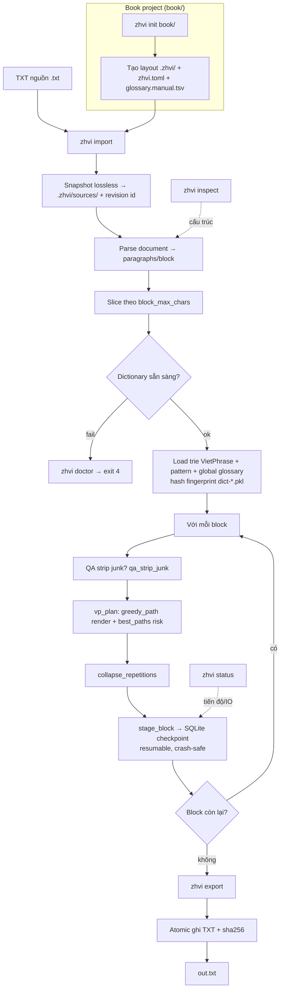

# zhvi

CLI dịch truyện **Trung → Việt** — **VietPhrase-only, offline, deterministic** theo thiết kế 3.0 (`_bmad-output/specs/spec-zhvi-vietphrase-only/`).

Không còn model dịch/AI post-edit: một đường sinh văn bản duy nhất là engine VietPhrase. Chất lượng đi lên qua vòng lặp kiểm chứng được: đo chỗ từ điển yếu → tạo entry/rule xác định → regression → revision mới → dịch lại.

- Snapshot nguồn **lossless** (dựng lại được 100% văn bản gốc).
- Parser document giữ nguyên cấu trúc (paragraph, quote, ellipse…).
- **VietPhrase lattice + trace** — render deterministic theo AD-9 (longest-match → layer precedence → literal-over-pattern → tie-break `entry_id`).
- **SQLite checkpoint** cho từng block — Ctrl-C giữa chừng tự resume.
- **Atomic export** (ghi temp → rename, kèm `sha256`); cùng fingerprint → cùng output SHA-256.
- Đọc trực tiếp `crawler/vietphrase/dicts/` (không copy), hash fingerprint cho từng run.
- Run mới chỉ ghi route `VIETPHRASE`; lịch sử model-era (thiết kế 2.0) giữ read-only, cache cũ bị invalidate.

---

## Luồng hoạt động



Tóm tắt 1 lệnh happy-path: `zhvi translate` tự động làm `import → parse → VP → checkpoint → export`.

---

## Cài đặt

```bash
# Từ repo root, với .venv sẵn có
.venv/bin/pip install -e zhvi/
```

Sau khi cài đặt, binary `zhvi` nằm trong `.venv/bin/`. Chạy từ **repo root** để đường dẫn mặc định `crawler/vietphrase/dicts` và `~/.config/zhvi/glossary.manual.tsv` resolve đúng.

> **Cần từ điển?** `zhvi doctor` sẽ báo thiếu. Đường dẫn mặc định:
> `crawler/vietphrase/dicts/` (đã có sẵn trong repo, không cần copy).

---

## Nhanh chóng (Happy path)

### 1 lệnh, tự tạo workspace cạnh file

```bash
# truyen.txt → truyen.zhvi/ (workspace auto) → truyen.vi.txt
zhvi translate truyen.txt -o truyen.vi.txt
```

Nếu muốn chỉ rõ thư mục từ điển:

```bash
zhvi translate truyen.txt -o truyen.vi.txt --dict-dir ../crawler/vietphrase/dicts
```

> Chạy lại cùng file + cùng config = **no-op** (in lại output hiện có). Ctrl-C giữa
> chừng giữ toàn bộ block đã commit; chạy lại tự **resume**.

---

## Các lệnh

### `zhvi init <project>`
Tạo project mới cho một truyện (layout `.zhvi/`, `zhvi.toml`, `glossary.manual.tsv`). Idempotent — project đã tồn tại không bị ghi đè.

```bash
zhvi init ./books/my-book
```

### `zhvi import <file> --project|-p <project>`
**Snapshot an toàn** file TXT nguồn vào project (freeze bản gốc, sinh `revision id`).

| Option | Mặc định | Ý nghĩa |
|---|---|---|
| `--project`, `-p` | — | Project đích (nếu thiếu, tự workspace `<file>.zhvi/`) |
| `--encoding` | `utf-8` | Mã hoá file nguồn |
| `--update` | off | Nhận file này làm source mới của project |

```bash
zhvi import ./crawl/chap1.txt -p ./books/my-book
```

### `zhvi inspect [--project|-p <project>] [--source <file>]`
Báo cáo cấu trúc document (số block, loại block, mất mát…).

```bash
zhvi inspect -p ./books/my-book
zhvi inspect --source ./crawl/chap1.txt --sample 50
```

### `zhvi translate [<file>] [options]`
Happy path: snapshot → parse → VP → checkpoint → atomic export. Có thể dùng với file trực tiếp **hoặc** `--project`.

| Option | Mặc định | Ý nghĩa |
|---|---|---|
| `-o`, `--output` | — | File đích (TXT đã dịch) |
| `--project`, `-p` | — | Project (có sẵn source) |
| `--style` | `convert-qt` | Style dịch |
| `--encoding` | `utf-8` | Mã hoá nguồn |
| `--dict-dir` | `crawler/vietphrase/dicts` | Thư mục từ điển |
| `--json` | off | In báo cáo JSON ra stdout (máy đọc được) |

```bash
# với project
zhvi translate -p ./books/my-book -o ./books/my-book/dist/vi.txt
# với file trực tiếp, báo cáo JSON
zhvi translate chap2.txt -o chap2.vi.txt --json
```

### `zhvi status --project|-p <project>`
Tiến độ run, route, cache, lỗi, review dưới dạng JSON.

```bash
zhvi status -p ./books/my-book
# thoát code 7 nếu run chưa exported
zhvi status -p ./books/my-book --require-complete
```

### `zhvi export --project|-p <project> [-o <output>]`
Dựng lại TXT từ một run **đã COMMITTED đầy đủ**.

| Option | Mặc định | Ý nghĩa |
|---|---|---|
| `-o`, `--output` | — | File đích |
| `--run` | run hoàn tất gần nhất | Run ID cụ thể |
| `--replace` | off | Cho phép ghi đè output đã tồn tại |

```bash
zhvi export -p ./books/my-book -o ./books/my-book/dist/vi.txt
```

### `zhvi doctor [--project|-p <project>] [--dict-dir <dir>]`
Kiểm tra từ điển, SQLite/disk, smoke-test convert. Thoát code 4 nếu có vấn đề.

```bash
zhvi doctor --dict-dir ../crawler/vietphrase/dicts
```

### `zhvi review --project|-p <project> [--list | --output <jsonl>]`
Liệt kê / xuất các block cần người xem (invariant fail — block giữ draft VP + NEEDS_REVIEW).

```bash
zhvi review -p ./books/my-book --list          # đếm + tóm tắt JSON
zhvi review -p ./books/my-book -o review.jsonl # xuất JSONL từng block
```

---

## Cách dùng project (workflow đầy đủ)

```bash
# 1. Tạo vùng làm việc cho truyện
zhvi init ./books/my-book

# 2. Snapshot nguồn
zhvi import ./crawl/my-book.txt -p ./books/my-book

# 3. Xem cấu trúc (tuỳ chọn)
zhvi inspect -p ./books/my-book

# 4. Dịch
zhvi translate -p ./books/my-book -o ./books/my-book/dist/vi.txt

# 5. Kiểm tra tiến độ
zhvi status -p ./books/my-book

# 6. Export lại từ run committed (tuỳ chọn)
zhvi export -p ./books/my-book -o ./books/my-book/dist/vi.txt
```

---

## Cấu trúc project

```
books/my-book/
├── zhvi.toml                  # config project (style, pipeline, glossary...)
├── glossary.manual.tsv        # term khoá riêng cho truyện (book manual)
├── dist/                      # output đã dịch
└── .zhvi/                     # state (gitignore)
    ├── state.sqlite3          # DB: revision, run, block, route, review
    ├── sources/               # snapshot lossless nguồn (mỗi revision)
    ├── dictionaries/          # fingerprint từ điển
    ├── runs/                  # kết quả run
    ├── logs/
    ├── cache/                 # dict-<fingerprint>.pkl
    └── locks/                 # khoá chống ghi trùng (flock)
```

---

## Từ điển & Glossary

Đọc trực tiếp `crawler/vietphrase/dicts/` (không copy). Override bằng `--dict-dir` hoặc env `ZHVI_DICT_DIR`.

**Thứ tự load** (từ điển cơ sở, tăng dần độ ưu tiên):

```
ChinesePhienAmWords.txt
VietPhrase_1.txt
VietPhrase_2.txt
VietPhrase_3.txt
LuatNhan.txt
Names.txt
QualityOverrides.txt
Custom.txt           # thư viện term chuẩn, dùng chung mọi truyện
```

**Glossary (term khoá) — 3 tầng, ưu tiên tăng dần:**

| Tầng | Đường dẫn | Phạm vi |
|---|---|---|
| Cơ sở dict | `crawler/vietphrase/dicts/*.txt` | Toàn hệ thống |
| Global | `~/.config/zhvi/glossary.manual.tsv` | Mọi project trên máy |
| Book | `<project>/glossary.manual.tsv` | Riêng từng truyện |

Định dạng glossary: `zh=Từ gốc<TAB>vi=Từ dịch`, mỗi dòng một mục.

- **Book manual** override **global**, global override **dict cơ sở**.
- Term chuẩn xuyên truyện (vd `小胖 → Tiểu Bàn`) nên đưa vào `Custom.txt` hoặc
  `~/.config/zhvi/glossary.manual.tsv`, tránh lặp lại trong từng book.
- Đổi glossary / dict → fingerprint đổi → chỉ block liên quan được dịch lại.

> Env bổ trợ: `ZHVI_DICT_DIR`, `ZHVI_GLOBAL_GLOSSARY`.

---

## Kiến trúc VietPhrase-only (3.0)

Một đường dịch duy nhất — không model runtime, không network call:

```
source TXT → snapshot lossless → parse → load dictionary (fingerprint)
  → với mỗi block: vp_plan (greedy_path render + risk metric)
  → invariant gate (fail → giữ draft + NEEDS_REVIEW)
  → SQLite checkpoint → atomic export (SHA-256)
```

- **Route duy nhất**: `VIETPHRASE` — mọi block đi qua VietPhrase; block fail
  invariant được giữ nguyên draft và đưa vào `zhvi review` (không fallback ngầm).
- **Deterministic (AD-9)**: longest-match → layer precedence → literal-over-pattern
  → tie-break `entry_id` — không phụ thuộc thứ tự nap từ điển.
- **QA gates** (`quality/`): invariant (rỗng / còn CJK / nháy lệch), chapter audit.
- Migration từ thiết kế 2.0 mang tính cộng thêm: lịch sử run/block/route model-era
  giữ read-only; mọi block cache model-era bị đánh dấu invalid, không tái dùng.

---

## Config (`zhvi.toml`)

`zhvi init` sinh sẵn một template với comment giải thích. Schema 3.0 — các cờ chính:

| Cờ | Mặc định | Ý nghĩa |
|---|---|---|
| `style` | `convert-qt` | Style dịch |
| `output_policy` | `strict-final` | Chính sách output |
| `collapse_repetitions` | `true` | Loại bỏ lặp artifact (`có chút có chút`) giữa 2 span khác nhau; giữ reduplication gốc (慢慢 → chậm chậm) |
| `qa_strip_junk` | `true` | Strip rác truyện web (watermark ⓣⓣⓚ, bookmark, anti-leech) trên source **trước** khi dịch |
| `pattern_rules` | `true` | Bật luật nhân `{s}` (số) / `{n}` (danh từ) trong `LuatNhan.txt` — match regex + điền capture |
| `global_glossary` | `~/.config/...` | Đường dẫn glossary toàn cục |

Section `[learning]` (ngưỡng learner — epic 3/4 dùng) và `[runtime]`
(`checkpoint_blocks`) cũng nằm trong template.

**Precedence (từ cao → thấp):** CLI flag → env → `zhvi.toml` → mặc định.

---

## Exit codes

| Code | Ý nghĩa |
|---|---|
| `0` | OK |
| `2` | Usage (thiếu/ sai tham số) |
| `3` | Input / snapshot lỗi |
| `4` | Preflight fail (doctor, từ điển thiếu) |
| `5` | State (project không có source, lock conflict) |
| `6` | Run failed |
| `7` | Review / chưa exported |
| `8` | Export (ghi file lỗi, PermissionError…) |
| `9` | Integrity (sha256 không khớp) |
| `130` | KeyboardInterrupt |

---

## Test

```bash
cd zhvi && ../.venv/bin/python -m pytest tests/ -q
```

---

## Trạng thái (thiết kế 3.0)

- [x] **Epic 1 — VietPhrase-only cutover**: gỡ engine model/router/post-edit,
      config schema 3.0, migration additive (cache model-era invalid), đường dịch
      deterministic AD-9, test baseline (deterministic SHA-256 + resume parity).
- [ ] **Epic 2**: immutable dictionary revisions (bundle, publish, rollback).
- [ ] **Epic 3**: book learner (discovery, candidate, evidence, promotion gates).
- [ ] **Epic 4**: global learner & registry (cross-book evidence, fail-closed).
- [ ] **Epic 5**: QA structural gates, golden tooling, metamorphic tests.
